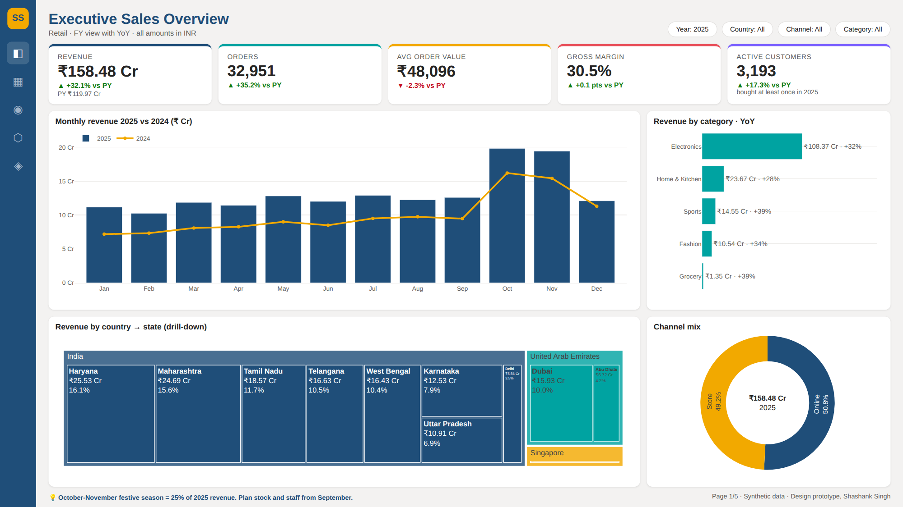
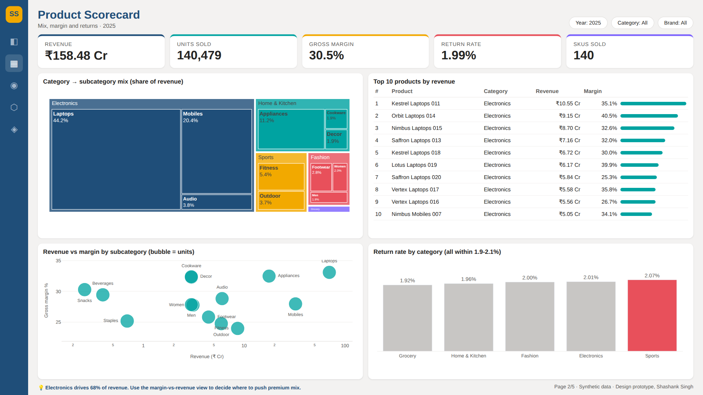
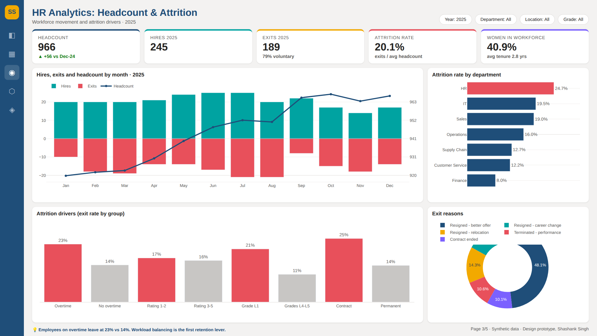
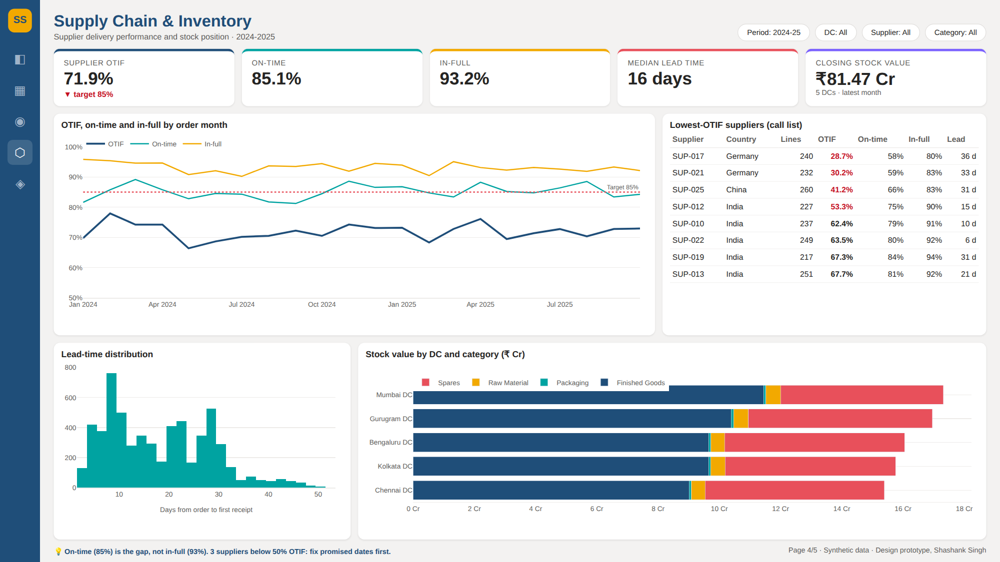
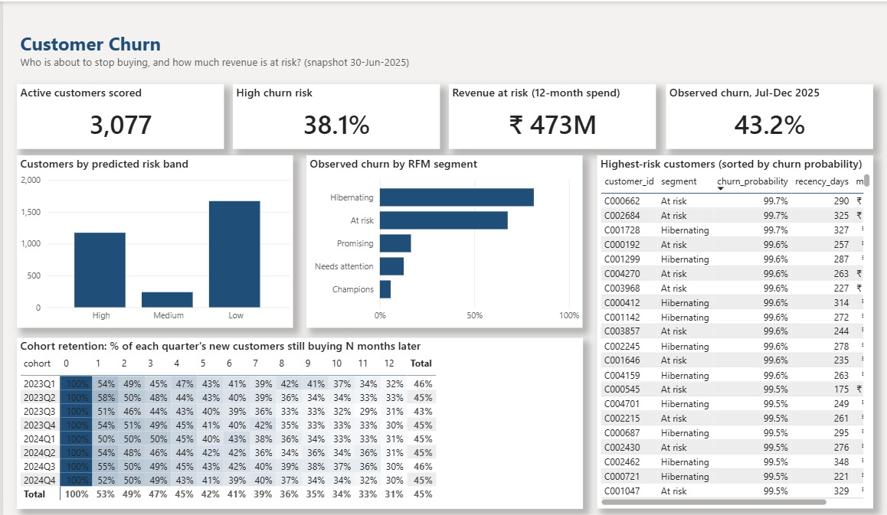
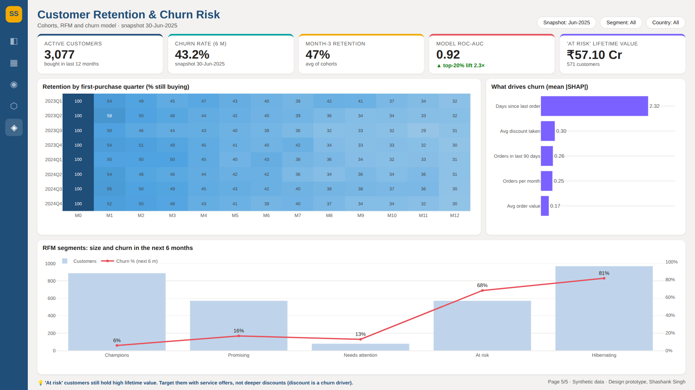

# Power BI Business Dashboards

**Five business dashboards (Sales, Product, HR, Supply Chain, Customer Retention), each built around one decision a manager has to make. Pages 1 and 5 are built in Power BI Desktop (PBIP, source in [sales-intelligence-powerbi](https://github.com/Shashan4321/sales-intelligence-powerbi)); pages 2-4 are design prototypes with a build spec and DAX, to be built next.**


| # | Dashboard | Business question it answers | Status |
|---|---|---|---|
| 1 | [Executive Sales Overview](#1-executive-sales-overview) | Are we growing, where, and through which channel? | ✅ Built in Power BI |
| 2 | [Product Scorecard](#2-product-scorecard) | Which products and categories make the money and the margin? | Design prototype |
| 3 | [HR Analytics](#3-hr-analytics-headcount--attrition) | Why are people leaving, and where should HR act first? | Design prototype |
| 4 | [Supply Chain & Inventory](#4-supply-chain--inventory) | Which suppliers break our delivery promise, and where is stock tied up? | Design prototype |
| 5 | [Customer Retention & Churn Risk](#5-customer-retention--churn-risk) | Which customers are about to leave, and what drives it? | ✅ Built in Power BI |

## 1 · Executive Sales Overview
**Power BI Desktop** (report page generated from code, refreshed on the gold data):

FY2025 (Apr-24 to Mar-25) net revenue ₹130.62 Cr, +90.3% on FY2024, the business's first full financial year. Calendar 2025: ₹158.48 Cr, +32.1%. The Country → State → City matrix shows India at 82.8% of revenue. Source: [`build_report.py`](https://github.com/Shashan4321/sales-intelligence-powerbi/blob/main/powerbi/build_report.py).

<details><summary>Original design prototype (Plotly)</summary>


</details>

## 2 · Product Scorecard

Electronics is 68% of revenue. Laptops alone are 44%. The revenue-vs-margin bubble chart shows where premium mix pays off.

## 3 · HR Analytics: Headcount & Attrition

Attrition 20.1%, 79% voluntary. Overtime (23% vs 14%), low ratings, L1 grade and contract status are the drivers. HR has the highest department attrition rate.

## 4 · Supply Chain & Inventory

Supplier OTIF 71.9% vs an 85% target. On-time (85%) is the gap, not in-full (93%). Three suppliers are below 50% OTIF.

## 5 · Customer Retention & Churn Risk
**Power BI Desktop:**

3,077 active customers scored at the 30-Jun-2025 snapshot: 38.1% are high risk, holding ₹47.3 Cr of 12-month spend. Around 47% of new customers are still buying in month 3. The churn model (ROC-AUC 0.92 on the test set, simulated behaviour) finds recency and heavy discounting as the main drivers.

<details><summary>Original design prototype (Plotly)</summary>


</details>

## How these were made

* **Data:** [`data/`](data). Sales and customer data are aggregates from [sales-intelligence-powerbi](https://github.com/Shashan4321/sales-intelligence-powerbi); supply-chain data from [fabric-lakehouse-end-to-end](https://github.com/Shashan4321/fabric-lakehouse-end-to-end); HR data from [`design/hr_data.py`](design/hr_data.py). All synthetic and seeded.
* **Design:** pages are laid out on the Power BI canvas (1600 × 900) with the colours and typography of [`theme/portfolio-theme.json`](theme/portfolio-theme.json), an importable Power BI theme. Pages 2-4, and the collapsed originals of pages 1 and 5, are high-fidelity **design prototypes** rendered by [`design/build.py`](design/build.py) (Python + Plotly) from the same data and measure definitions, so every value on them can be reproduced.
* **Built in Power BI:** pages 1 and 5 are real Power BI report pages in the [sales-intelligence-powerbi](https://github.com/Shashan4321/sales-intelligence-powerbi) PBIP project, using this theme. Screenshots are in [`screenshots/powerbi/`](screenshots/powerbi).
* **Next:** [`specs/page-specs.md`](specs/page-specs.md) lists, for each page, the visuals, fields and DAX measures. The DAX is in [DAX-Measures-Library](https://github.com/Shashan4321/DAX-Measures-Library). Pages 2-4 will be built in Power BI the same way.

```bash
pip install pandas numpy plotly playwright && playwright install chromium
python design/hr_data.py && python design/build.py   # re-renders screenshots/
```

## Design principles used

1. **One page = one decision.** The title says what the page is for, and the footer states the key insight.
2. **KPI row first:** value, change vs last year, and a comparison that tells you whether it is good or bad.
3. **Colour means something:** navy = actual, amber = comparison, red = needs attention, grey = context.
4. **Drill-down over clutter:** Country → State → City → Store instead of four separate charts.
5. **Honest scales:** bars start at zero, and small differences are called small (see return rate on page 2).

## Author

**Shashank Singh**, Senior Data Analyst / Power BI Developer · [Portfolio](https://shashan4321.github.io) · [LinkedIn](https://www.linkedin.com/in/shashank-moon)

*Professional impact:* built 10+ enterprise Power BI dashboards for 50+ stakeholders (star/snowflake schemas, DAX, RLS, drill-through, bookmarks) and cut reporting time by about 50%. Company dashboards are confidential, so this repo shows the same design approach on synthetic data.
